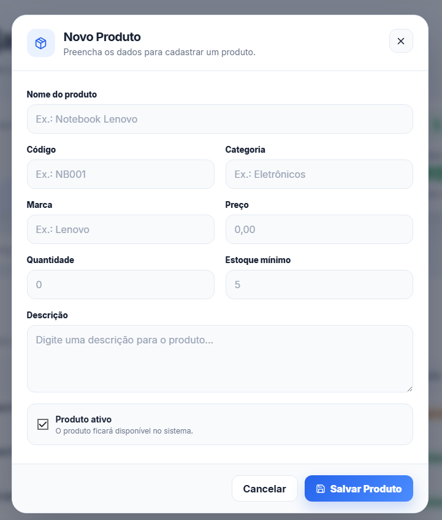
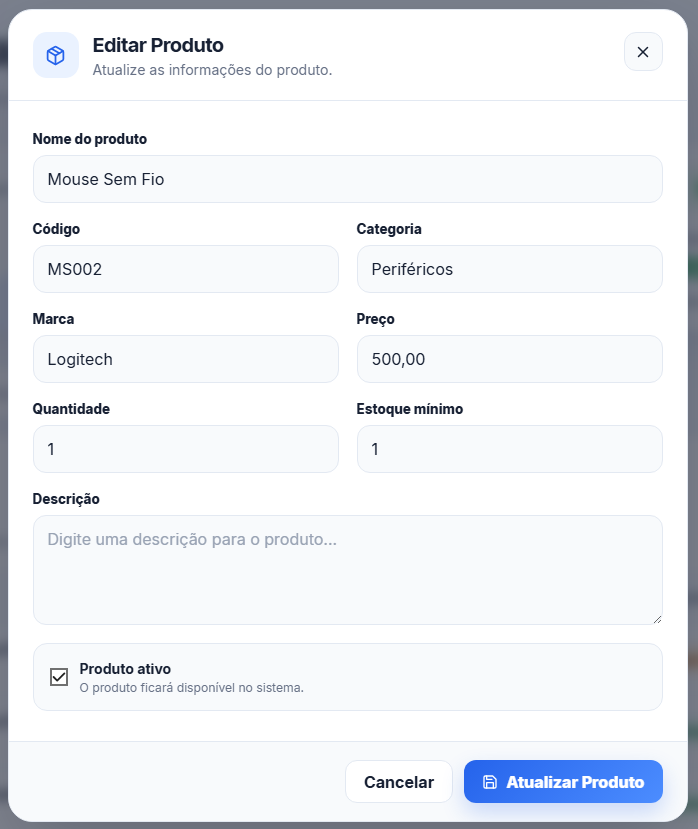
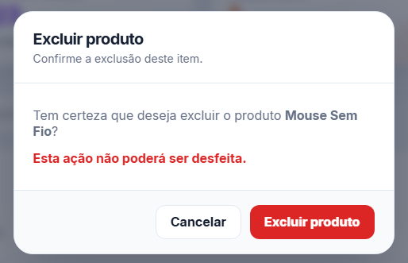

# Gestão de Estoque

Sistema Full Stack para gerenciamento de produtos desenvolvido com **React**, **Node.js**, **Express**, **PostgreSQL** e **Docker**.

O sistema permite cadastrar, editar, excluir e pesquisar produtos de forma simples e intuitiva.

---

# Tecnologias Utilizadas

## Frontend

- React
- Vite
- Axios
- React Icons
- CSS

## Backend

- Node.js
- Express
- PostgreSQL
- Docker
- Docker Compose

---

# Funcionalidades

- ✅ Cadastro de produtos
- ✅ Edição de produtos
- ✅ Exclusão de produtos
- ✅ Pesquisa em tempo real
- ✅ Dashboard com estatísticas
- ✅ Controle de estoque
- ✅ Validação de código duplicado
- ✅ Indicador de status do servidor
- ✅ Interface responsiva
- ✅ Dark Mode

---

# Estrutura do Projeto

```text
gestao-de-estoque/
│
├── backend/
│   ├── server.js
│   ├── package.json
│   ├── .env
│   └── src/
│       ├── controllers/
│       ├── database/
│       └── routes/
│
├── frontend/
│   ├── src/
│   │   ├── components/
│   │   ├── pages/
│   │   ├── services/
│   │   └── assets/
│   └── package.json
│
├── sql/
│   └── init.sql
│
├── docker-compose.yml
│
└── README.md
```

---

# Banco de Dados

O banco de dados é executado utilizando Docker com PostgreSQL.

Para iniciar:

```bash
docker compose up -d
```

Verificar containers:

```bash
docker ps
```

---

# Backend

Entrar na pasta:

```bash
cd backend
```

Instalar dependências:

```bash
npm install
```

Executar:

```bash
npm run dev
```

Servidor:

```
http://localhost:3000
```

---

# Frontend

Entrar na pasta:

```bash
cd frontend
```

Instalar dependências:

```bash
npm install
```

Executar:

```bash
npm run dev
```

Aplicação:

```
http://localhost:5173
```

---

# Imagens do Projeto

## Dashboard


---

## Cadastro de Produto





---

## Edição de Produto





---

## Exclusão de Produto





---

# Desenvolvido por

**Camilla Vieira**

Projeto desenvolvido para a disciplina de Desenvolvimento Full Stack.